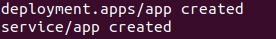
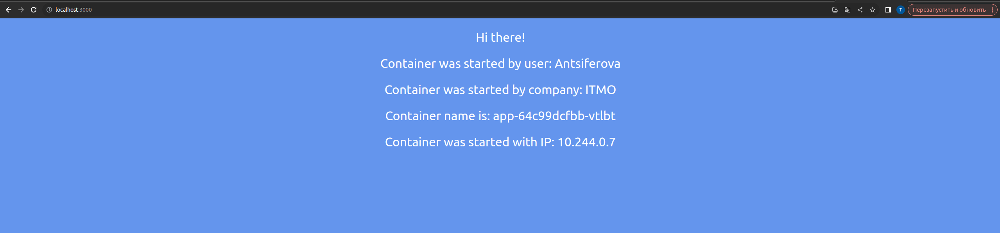
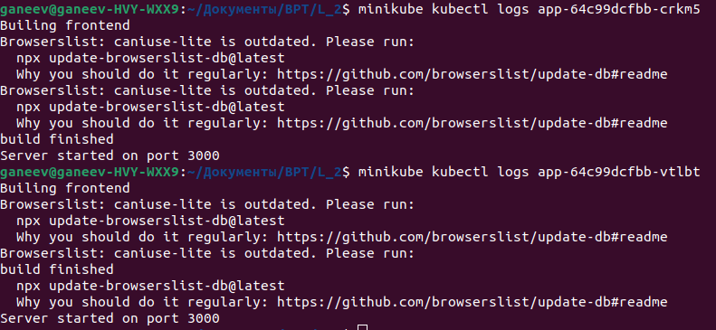
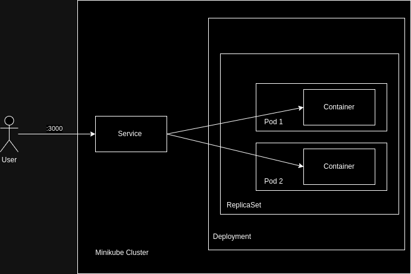

# 2023_2024-introduction_to_distributed_technologies-k4111c-antsiferova_t_a

University: [ITMO University](https://itmo.ru/ru/)
Faculty: [FICT](https://fict.itmo.ru)
Course: [Introduction to distributed technologies](https://github.com/itmo-ict-faculty/introduction-to-distributed-technologies)
Year: 2023/2024
Group: K4111c
Author: Antsiferova Tatiana Anatolievna
Lab: Lab2
Date of create: 08.11.2023
Date of finished: 

## Лабораторная работа №2 "Развертывание веб сервиса в Minikube, доступ к веб интерфейсу сервиса. Мониторинг сервиса."
### Описание работы
В данной лабораторной работе предлагается познакомится с развертыванием полноценного веб сервиса с несколькими репликами.
### Цель работы
Ознакомиться с типами "контроллеров" развертывания контейнеров, ознакомится с сетевыми сервисами и развернуть свое веб приложение.
### Ход работы
#### Запуск minikube cluster
Аналогично 1-ой лабораторной работе запускаем minikube:

```bash
😄  minikube v1.31.2 on Ubuntu 22.04 
✨  Using the docker driver based on existing profile
👍  Starting control plane node minikube in cluster minikube
🚜  Pulling base image ...
🔄  Updating the running docker "minikube" container ...
🐳  Preparing Kubernetes v1.27.4 on Docker 24.0.4 ...
🔎  Verifying Kubernetes components...
    ▪ Using image gcr.io/k8s-minikube/storage-provisioner:v5
🌟  Enabled addons: storage-provisioner, default-storageclass
🏄  Done! kubectl is now configured to use "minikube" cluster and "default" namespace by default
```
#### Создание манифеста `deployment.yaml`:
Создан манифест `deployment` с 2 репликами контейнера [ifilyaninitmo/itdt-contained-frontend:master](https://hub.docker.com/repository/docker/ifilyaninitmo/itdt-contained-frontend) и переданы переменные в эти реплики: `REACT_APP_USERNAME`, `REACT_APP_COMPANY_NAME` со значениями  `Antsiferova` и `ITMO` соотвественно:

```yaml
apiVersion: apps/v1
kind: Deployment
metadata:
  name: app
  labels:
    app: app
spec:
  replicas: 2
  selector:
    matchLabels:
      app: app
  template:
    metadata:
      labels:
        app: app
    spec:
      containers:
      - name: itdt-contained-frontend
        image: ifilyaninitmo/itdt-contained-frontend:master
        env:
          - name: REACT_APP_USERNAME
            value: 'Antsiferova'
          - name: REACT_APP_COMPANY_NAME
            value: 'ITMO'
        ports:
          - containerPort: 3000
```
#### Создание сервиса через который будет доступ на эти "поды".
В  том же файле deployment.yaml создаем сервис:

```yaml
apiVersion: v1
kind: Service
metadata:
  name: app
spec:
  type: NodePort
  ports:
    - port: 3000
      protocol: TCP
      name: http
      targetPort: 3000
  selector:
    app: app
```
Далее с помощью следующей команды запускаем под:
```bash
minikube kubectl -- apply -f deployment.yaml
```


Далее с помощью следующей команды прокидываем порта:

```bash
minikube kubectl port-forward service/app 3000:3000
```


Подключаемся к контенйерам с браузера и проверяем:


#### Ответы на вопросы
1. Переменные `REACT_APP_USERNAME`, `REACT_APP_COMPANY_NAME` не изменяются, поскольку они прописываются в манифесте и совпадают для обоих подов.
Может изменятся `Container name`, в зависимоти от того, в какой "под" пойдет запрос.
2. Логи одинаковые
   


#### Схема организации контейеров и сервисов


